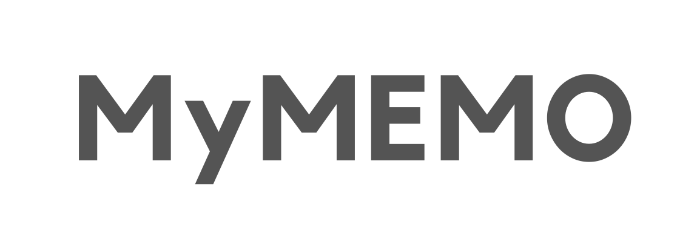

<p align="center">
  <a href="#">
    
  </a>
  <br/>
  
 </p>
 

<p align="center">
Publicly accessible platform for sharing opinion and thoughts on any subject</p>
<br>


## Project Overview

This simple platform helps to express opinion in a written form on any topic, that concerns. Users access platform through google account can publish their posts, edit or delete them. Those, who doesn't have account can only read posts. 


## Preview
<center>
  
</center>


## Main Features & Architectural Notes
- :hammer_and_wrench: Built with **React.js** library
- :fire: Data management and authentication provided by **Firebase**
- :art: Styled with **Tailwind CSS** framework 
- :date: Dates formatting supported with **moment.js**

## Getting Started

```bash
git clone https://github.com/felistter/mymemo-blog.git
cd mymemo-blog 
npm install
npx craco start
```

## License

Licensed under the MIT License.


